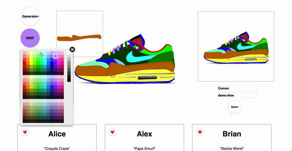

# Air-Color

Click on any part of the sneaker to edit, then click the 'Color+' button to select a color from a dropdown to adjust the fill. Once a design has been completed, click the 'Generate+' button to generate a screenshot. The screenshot can then be saved with a user's name and shoe title. Here is a link to a demo of the front-end, https://air-color.netlify.com/.

### Build-Considerations
To check-out a more in-depth review of the project please check out my article on medium, https://medium.com/p/8c1e79c7f118/edit.

How to generate a screenshot using html2canvas.js https://medium.com/swlh/creating-a-screenshot-from-a-div-using-html2canvas-65b389532156.
